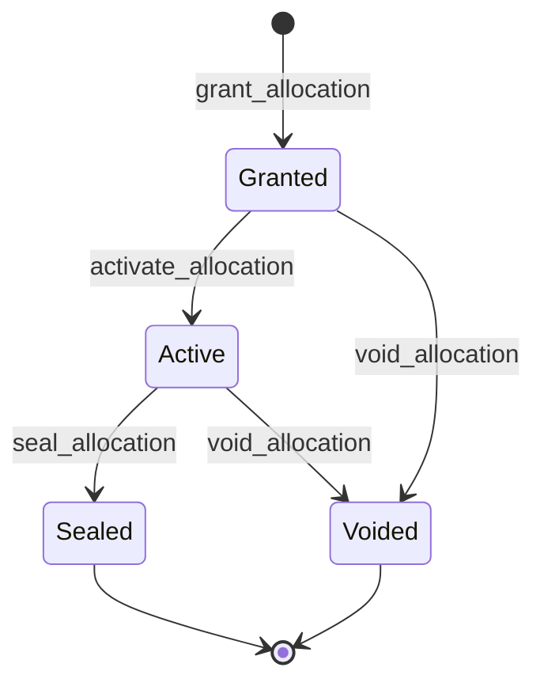

# Budget module <span class="md-maturity md-maturity--beta" title="Single founding aggregate, one single-axis FSM, five events, five slices, projection and Postgres lookup adapter shipped; the ceiling is enforced post-hoc by the agent-side gate, and facility-unit accounting beyond USD is deferred.">beta</span>

## Purpose & Scope

The Budget module models the spending envelope a beamline receives and spends. One aggregate, `Allocation`, carries a USD ceiling, an operator-facing note, an optional Campaign binding, and a four-state lifecycle. It is the instrument-wide arm of CORA's LLM-spend control: where an Agent's own `monthly_usd_cap` and `daily_token_cap` bound one agent, an Allocation bounds everything the deployment spends inside one award window.

Balance is never stored. It folds from the same inference ledger every other spend tier sums, so the aggregate carries only the envelope's declared shape (ceiling, note, window timestamps) and its state. The allocation's own lifecycle IS the award window: `activated_at` opens it, `sealed_at` closes it. No calendar arithmetic lives here, because the calendar case is the per-agent caps' territory.

The holder is implicit at v1: the deployment's own beamline, one CORA instance, one beamline at the pilot. An optional `campaign_id` binds the award window to a Campaign's lifecycle, and when it is set the `CampaignClosed` subscriber seals the envelope alongside the campaign's own books.

<div class="cora-aside cora-aside--deferred" markdown>

Out of scope
{: .cora-kicker }

- **Stored balance.** There is no `spent_usd` field on the aggregate and no running total maintained by the evolver. Spend folds from the inference ledger on read. The one snapshot that is stored, `spent_usd_at_seal`, is written once at seal time precisely because the books are closing.
- **Facility units beyond USD.** `ceiling_usd` is USD-only at v1. Node-hours and other facility-unit accounting wait for the first in-house GPU pool.
- **Calendar windows.** No `starts_at` / `expires_at` pair. The lifecycle is the window, and per-agent monthly and daily caps already own the calendar case.
- **Multi-holder allocations.** No holder reference on the aggregate. A second holder kind (a proposal, a research group, a partner facility) is deferred until a deployment has more than one beamline to hold an envelope.
- **Pre-flight spend refusal.** The envelope check is post-hoc: the agent-side gate debits after each call and refuses the next one once the ceiling is breached, so overspend is bounded to roughly one in-flight call rather than prevented outright. See the Agent module for the gate's failure direction.
- **A public read surface.** All five slices are commands. There is no `get_allocation` or `list_allocations` route or MCP tool: the projection exists to serve the gate's internal lookup, not a caller. An operator reads an envelope's state from the event log or the read model directly until a query slice earns its place.

</div>

## Aggregates

| Name | Identity | State summary | FSM |
|---|---|---|---|
| `Allocation` | `id: UUID` (server-minted UUIDv7, or caller-supplied for configuration-seeded envelopes needing stable ids across environments) | `id`, `ceiling_usd`, `note`, `campaign_id?`, `granted_at`, `granted_by`, `status`, `activated_at?`, `activated_by?`, `sealed_at?`, `sealed_by?`, `spent_usd_at_seal?`, `end_reason?` | yes (single axis) |

## Value Objects

| Name | Shape | Rule |
|---|---|---|
| `AllocationNote` | bounded text, 200 characters | Operator-facing name for the envelope: an award cycle, a proposal block. Required and non-empty. |
| `ceiling_usd` | `float` | Finite and strictly positive. A zero or negative ceiling would make every envelope check refuse unconditionally, and a non-finite one would never refuse, so both are construction-time errors rather than representable states. |

## FSM

A single axis, `AllocationStatus`, per the lifecycle-versus-status naming rule. `Granted` is the award's dormant phase, granted at approval but not yet spending. `Active` opens the spend window. The two terminals stay distinct because they answer different audit questions: `Sealed` says this envelope's books closed, `Voided` says the award never stood, which is why only the former carries a final-spend snapshot.



`update_allocation_ceiling` is accepted in both `Granted` and `Active` and changes no state: an update is not a lifecycle step.

## Events

| Event | Payload | Emitted by |
|---|---|---|
| `AllocationGranted` | `allocation_id`, `ceiling_usd`, `campaign_id?`, `note`, `granted_by`, `occurred_at` | `grant_allocation` |
| `AllocationActivated` | `allocation_id`, `activated_by`, `occurred_at` | `activate_allocation` |
| `AllocationCeilingUpdated` | `allocation_id`, `ceiling_usd`, `occurred_at` | `update_allocation_ceiling` |
| `AllocationSealed` | `allocation_id`, `spent_usd`, `reason?`, `sealed_by`, `occurred_at` | `seal_allocation`, and the `CampaignClosed` sealer |
| `AllocationVoided` | `allocation_id`, `reason`, `occurred_at` | `void_allocation` |

The ceiling on `AllocationCeilingUpdated` is the post-update ceiling, not a delta. The cost-overrun tighten lever must land at an exact number the operator chose, and a delta would compound across retries.

## Slices

<!-- arch:slices-table bc=budget -->
_Generated from the code at build time._
<!-- /arch:slices-table -->

## Storage & Projections

`AllocationSummaryProjection` writes the read model that `PostgresAllocationLookup` reads through, which is how the agent-side gate finds the Active envelope without folding the stream. The `AllocationSealerSubscriber` reacts to `CampaignClosed` by sealing the campaign-bound Active allocation, deriving its timestamp from the triggering event's `occurred_at` rather than wall clock so a replay seals at the same instant.

## Cross-Module boundaries

| Module | Relationship | What is exchanged |
|---|---|---|
| `campaign` | `written-by` | A `CampaignClosed` event seals the bound envelope. Authority to close a campaign therefore transitively lifts a ceiling, which is why both belong in the same authorization tier. |
| `agent` | `read-by` | The agent-side budget gate reads the Active envelope's ceiling through `AllocationLookup` and refuses the next call once the instrument-wide total breaches it. |

Every one of the five commands bounds the whole instrument's LLM spend, so a real Trust policy should treat them as a single instrument-admin tier kept off the routine-operator grant. Under the default permissive authorization posture they are open, which is the pre-existing deployment default rather than anything this module introduces.

## Examples

The two examples below follow the canonical envelope path: grant a dormant award, then activate it to open the spend window. For the REST/MCP equivalence, auth, and idempotency conventions these examples share, see [Reading the examples](../index.md) on the Modules landing page.

### Grant an Allocation

=== "REST"

    ```http
    POST /allocations
    Content-Type: application/json
    Idempotency-Key: 3f7a1d2c-9b4e-4c2a-8d1f-6e5a4b3c2d10
    X-Principal-Id: 7b1f2d4e-2a3c-4d5e-8f9a-1b2c3d4e5f60

    {
      "ceiling_usd": 2500.0,
      "note": "2026-2 award cycle"
    }
    ```

    A successful call returns `201 Created` with `{"allocation_id": "<uuid>"}`. The envelope starts `Granted` and does not constrain spend until it is activated. `campaign_id` and `allocation_id` are both optional and may be omitted or passed as null.

=== "MCP"

    ```python
    mcp.call_tool(
        "grant_allocation",
        {
            "ceiling_usd": 2500.0,
            "note": "2026-2 award cycle",
        },
    )
    ```

    Returns the same response shape as the REST call.

### Activate the Allocation

=== "REST"

    ```http
    POST /allocations/0193f0a2-1c4d-7e8f-9a0b-1c2d3e4f5061/activate
    X-Principal-Id: 7b1f2d4e-2a3c-4d5e-8f9a-1b2c3d4e5f60
    ```

    A successful call returns `204 No Content`. The envelope moves `Granted` to `Active`, `activated_at` opens the spend window, and the gate stack begins refusing spend that would breach `ceiling_usd`.

=== "MCP"

    ```python
    mcp.call_tool(
        "activate_allocation",
        {"allocation_id": "0193f0a2-1c4d-7e8f-9a0b-1c2d3e4f5061"},
    )
    ```

    Returns the same empty success as the REST call.
