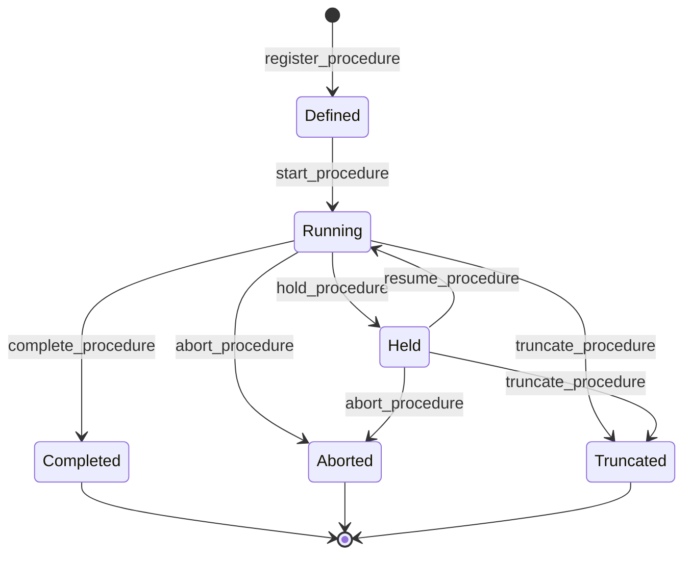

# Operation module <span class="md-maturity md-maturity--stable" title="Aggregate, FSM, events, slices, projections, and per-step entry table all locked; the Held pause state and the pinned-step-list resume path have shipped on top.">stable</span>

## Purpose & Scope

The Operation module models one execution of an episodic operational task: bakeout, characterization, optical alignment, beam-mode change, recovery procedure, ID maintenance, KB switching. Operators register a Procedure, start it, append per-step records (setpoint applied, action performed, check verified), then close it via complete, abort, or truncate. Both instrument-level and facility-envelope procedures share this aggregate.

A Procedure is distinct from a Run by what it leaves of record: a Run exists to produce a primary `Dataset` (a measurement or computed lot; ISA-88 batch lens), while a Procedure changes or verifies equipment state and leaves a `Calibration` value or only a step log, never a Dataset-of-record (ISA-106 lens). The Subject is metadata on a Run, not the discriminator: calibration captures are subject-less Runs. See the [Run vs Procedure boundary](../../../reference/modeling.md#run-vs-procedure-boundary) rule. When `parent_run_id` is set, the Procedure is a Phase-of-Run (alignment invoked mid-Run); when None, it stands alone (bakeout between Runs).

**Execution.** Walking a Procedure step by step, applying each setpoint, running each action, verifying each check, is an optional edge runtime CORA offers for facilities that choose it. The `Conductor` dispatches steps through a substrate-neutral `ControlPort`, with EPICS Channel Access and PVA adapters shipped; a facility may use it or keep its own tooling. Its lower bound is the deterministic real-time loop, which stays in the control system. See [the recording spine and the optional execution edge](../../standards.md#the-recording-spine-and-the-optional-execution-edge).

**Pause and resume.** A halted conduct can be re-established and resumed rather than aborted and reseeded. `hold_procedure` pauses `Running` to `Held` and `resume_procedure` returns `Held` to `Running`; the pair is bidirectional and unlimited-cycle within one conduct, each hold requiring an intervening resume. The hold `reason` is REQUIRED (1-500 chars), unlike the slim `RunHeld`, because pausing a halted conduct is a deliberate, high-information operator act. Resume carries a `re_establishment_boundary`, the index in the PINNED resolved step list from which it re-drives setpoints and re-runs checks. That is deliberately a re-establishment boundary and not a continuity proof: the aggregate owns no verified-continuity claim. The pinning is what makes replay honest. `ResolvedStepsRecorded` captures the final resolved list before any step executes, after recipe re-expansion and pseudoaxis resolution, so resume replays that exact list rather than re-deriving it from live `Plan.wires`, partition rules, and calibrations, which could yield a different list and silently skip or mis-target a step. Two conduct entry points ride on this. `conduct_or_hold_procedure` differs from `conduct_procedure` only in failure posture: a RECOVERABLE step failure (a setpoint or a check, re-drivable on resume) pauses to `Held` instead of aborting, while a non-recoverable failure (an action, an interrupted acquisition), a lifecycle failure, and a mid-execute cancellation keep the abort posture. `conduct_from_procedure` then resumes and replays the pinned tail, auto-completing on a clean tail, leaving the Procedure `Running` on an acquisition halt that needs an operator decision (redo fresh versus reseed), and best-effort aborting on a genuine step failure. `Held` accepts no step appends, and `complete_procedure` does not accept `Held`, so a paused Procedure must resume before it can reach the happy-path terminal; abort and truncate accept it directly. One off-diagonal guard: a `Held` Procedure whose parent Run is itself `Held` cannot resume and walk real setpoints while the Run is paused. There is no cascade the other way, from Run-resume into Procedure-resume; that is a Layer-3 saga and stays deferred.

**Iteration.** Many procedures converge over repeated passes: an optical alignment nudges a mirror, re-measures, and repeats until the beam is centered. CORA models each pass as a first-class iteration through the `ProcedureIterationStarted` / `ProcedureIterationEnded` boundary pair, recording per-pass timing and a convergence verdict (`converged` true, false, or no-verdict, plus an optional `reason`). Iteration is orthogonal to the lifecycle FSM: it is a counter and a per-pass read model on a `Running` Procedure, not a status. An optional `max_consecutive_unconverged_iterations` cap, set at register time (the "patience" of early-stopping vocabulary), lets the loop give up: once that many consecutive passes end without `converged=true`, `start_iteration` refuses with `ProcedureIterationLimitReachedError` and the operator or agent decides whether to abort, truncate, or complete. A `converged=true` pass resets the streak. Before iteration was first-class, alignment scenarios smuggled the pass number into a free-form `evidence['iteration']` key; that ad-hoc convention is now retired and banned by a fitness test.

**Steering.** A convergence loop follows a fixed recipe; a steered loop asks a brain where to look next. `conduct_until_advised` is the decide-axis twin of the convergence loop: after each pass it hands the accumulated evidence to a `DecidePort` and seeds the next pass from the point the brain advises, until the brain advises stop. The seam is deliberately optimizer- and action-neutral, expressed as six nouns: an objective (what "good" means, named by a measurement), a search space of axes, the evidence so far, one observation, the advice returned, and a budget. Optimizer internals (kernel, acquisition, surrogate) never cross the seam; a next point is coordinates keyed by axis name, never a command, so translating a point into steps stays the loop's job. The brain is handed the full history every call and is assumed to hold no memory between calls, which keeps a pure-function brain and a stateful one behind one surface. Shipped brains: an in-memory fake, a deterministic `grid_walk` sweep, a `sobol` low-discrepancy initial-design seeder, a `botorch` Gaussian-process Bayesian-optimization brain, and a `staged` composite that seeds with Sobol then hands off to the GP once enough successful observations exist. The GP brain and Sobol seeder need the optional `bo` dependency group (BoTorch, on PyTorch); the base install stays lean. When a learning brain decides a pass, the fitted model's summary scalars (per-axis lengthscales, observation noise, acquisition value) are captured for audit as one row per iteration in a per-Procedure diagnostics logbook (a `Diagnostic` entry kind alongside the `Activity` step log; a side table that does not fold into aggregate state), so a reviewer can later reconstruct why the brain advised a given point. Because a Gaussian-process fit is not bit-reproducible across environments even with a fixed seed, a GP-steered run cannot be reconstructed by re-asking the brain. Instead the loop records the coordinate the brain advised each pass (`advised_next_point` on the iteration event), surfaced alongside the verdict and deciding brain in the per-iteration read model, so a finished GP-steered run is reconstructable by reading the recorded decision trail. The run stays classified "forward-only" (meaning not re-ask-reproducible, distinct from not-recorded and, now, distinct from not-resumable). A crashed GP-steered run resumes through `conduct_until_advised_from`: it rebuilds the brain's history from the record, the measured value of each closed pass from a per-Procedure outcome logbook (an `Outcome` entry kind, sibling to the diagnostics log) and the advised coordinate from the iteration trail, then consults the brain only at the open frontier. Resume neither re-asks the brain for a pass already done nor re-drives hardware to a past position: the next move is an absolute one issued from wherever the instrument now sits, which reaches the same commanded point regardless of the current position, and direction-of-approach consistency (anti-backlash) is a per-move concern of the motion controller, not of resume. True sample path-dependence (thermal or radiation history, mechanical creep) is shaped by the whole trajectory rather than any single point, so it belongs in provenance, not in a resume-time re-drive; re-establishing one historical setpoint would neither be necessary nor sufficient. See [the recording spine and the optional execution edge](../../standards.md#the-recording-spine-and-the-optional-execution-edge).

<div class="cora-aside cora-aside--deferred" markdown>

Out of scope
{: .cora-kicker }

- **Cross-aggregate resume cascade.** Pause and resume ship on the Procedure itself (see above), but resuming a parent Run does NOT cascade into its held phase Procedures; the off-diagonal guard only refuses the illegal direction. Coordinating both is a Layer-3 saga, deferred.
- **Verifying as a first-class FSM state.** Per-step Check happens inside Running synchronously; the standards corpus does not bless a separate Verifying state.
- **Per-kind payload validation at the API.** The step `payload` body is `dict[str, Any]` today; per-kind Pydantic models land once pilot vocabulary settles.
- **Asset-existence verification at register time.** `target_asset_ids` is taken at face value; existence and decommission-state gating runs at start-procedure time.
- **Procedure declares its output quantity.** A Procedure does not declare which Calibration quantity it yields (an alignment producing `rotation_center`, a characterization producing `detector_pixel_size`). The human bridging an alignment to a Calibration knows this implicitly; an automatic `ProcedureCompleted` agent would need it declared. Deferred until that agent is built.

</div>

## Aggregates

| Name | Identity | State summary | FSM |
|---|---|---|---|
| `Procedure` | `id: UUID` (opaque) | name, kind, target asset ids, status, optional `parent_run_id`, the three lazily-opened logbook ids (`activity_logbook_id`, `diagnostic_logbook_id`, `outcome_logbook_id`), optional `capability_id`, optional `recipe_id`, `iteration_count`, optional `current_iteration_index`, `consecutive_unconverged_iterations`, optional `max_consecutive_unconverged_iterations`, optional `actuation_kind` | yes |

## Value Objects

| Name | Shape | Where used |
|---|---|---|
| `ProcedureName` | trimmed bounded text, 1-200 chars | `Procedure.name` |
| `ProcedureAbortReason` | trimmed bounded text, 1-500 chars; decider-input only | `abort_procedure` body |
| `ProcedureTruncateReason` | trimmed bounded text, 1-500 chars; decider-input only | `truncate_procedure` body |
| `ProcedureStatus` | closed StrEnum `{Defined, Running, Held, Completed, Aborted, Truncated}`; `Held` is the operator-pause state (`Running` to `Held` via `hold_procedure`, back via `resume_procedure`), mirroring `RunStatus.HELD` | `Procedure.status` |
| `StepKind` | closed `Literal["setpoint", "action", "check", "capture", "compute"]`; the setpoint / action / check core renames ISA-106's Command / Perform / Verify triplet, and capture (a runtime value read) plus compute (a `ComputePort` job submission) extend it for the conduct-path runtimes | per-step entry rows |

`Procedure.kind` is a bare `str` (1-50 chars, validated at the decider) rather than a VO, mirroring the `Supply.kind` precedent: pilot vocabulary will settle and the field will graduate to a closed `ProcedureKind` StrEnum later. Documented starter vocabulary: `bakeout`, `characterization`, `alignment`, `recovery`, `beam_mode_change`, `id_maintenance`, `kb_switching`, `optical_alignment`, `vacuum_regeneration`.

### Procedure-kind naming convention

When a deployment instantiates a specific operation, the `kind` reads `<subject>_<operation-noun>` with the operation noun LAST: `motor_homing`, `center_alignment`, `energy_characterization`, `detector_z_rail_alignment`, `slit_centering`, `blade_throw_characterization`. The operation noun is a noun, never a leading imperative verb: a gerund (`homing`, `centering`), a `-tion` / `-ment` (`characterization`, `alignment`), or an established operation-noun (`reboot`, `change`). It is the Capability family the procedure realizes, or a sharper operation within it (`homing` / `centering` sit under `maintenance` / `alignment`); the abstract vocabulary above names those families, and a kind qualifies one with its subject. This echoes the `Family` noun-LAST rule ([naming](../../../reference/naming.md)).

Two anti-patterns this rules out, with the corpus already normalized to match:

- **Verb-phrase-first.** `center_and_close_slits` -> `slit_centering` (fold the steps into one operation noun); the coordinated moves `set_energy` -> `energy_setting` and `switch_to_mono` / `switch_to_pink` -> a single `beam_mode_change` (target mode as a parameter, not two verb-first kinds).
- **Act named for its value.** A measuring act is a `*_characterization` (`blade_throw_characterization`); the value it produces is a Calibration with a value-noun (`blade_throw_scale`), or a new revision of an existing curve (`energy_characterization` re-saves the `energy_position_curve`), never a procedure named `*_calibration`.

Narrow carve-out: capture-and-store procedures use `<condition>_field` (`dark_field`, `flat_field`) where the trailing noun is the produced artifact, the captured field. The convention is enforced by `tests/architecture/test_procedure_kind_naming.py`, which scans every `RegisterProcedure(kind=...)` and `RegisterProcedureFromRecipe(kind=...)` literal (the recipe-driven registration path carries the same `kind` field) against an approved operation-noun set plus the carve-out allowlist.

## FSM



| From | To | Command | Event |
|---|---|---|---|
| `[*]` | `Defined` | `register_procedure` | `ProcedureRegistered` |
| `Defined` | `Running` | `start_procedure` | `ProcedureStarted` |
| `Running` | `Held` | `hold_procedure` | `ProcedureHeld` |
| `Held` | `Running` | `resume_procedure` | `ProcedureResumed` |
| `Running` | `Completed` | `complete_procedure` | `ProcedureCompleted` |
| `Running` \| `Held` | `Aborted` | `abort_procedure` | `ProcedureAborted` |
| `Running` \| `Held` | `Truncated` | `truncate_procedure` | `ProcedureTruncated` |

**The pause state is not a terminal waiting room.** `complete_procedure` is `Running`-only, so a `Held` Procedure must resume before it can reach the happy-path terminal, while abort and truncate accept `Held` directly (an operator who has decided the paused conduct is not worth resuming does not have to resume it first). Hold and resume are both strict-not-idempotent: re-holding a `Held` Procedure and re-resuming a `Running` one each raise.

**Iteration is orthogonal to the FSM.** `start_iteration` and `end_iteration` open and close a convergence pass on a `Running` Procedure. They emit `ProcedureIterationStarted` / `ProcedureIterationEnded` and bump counters, but do NOT change `status`, so they are not rows in the table above. `start_iteration` is rejected unless the Procedure is `Running`, no iteration is already open, and the supplied `iteration_index` is the strict successor of `iteration_count` (`ProcedureCannotStartIterationError`); it also enforces the optional patience cap (`ProcedureIterationLimitReachedError`). `end_iteration` requires the supplied index to match the open iteration (`ProcedureCannotEndIterationError`) and records the convergence verdict.

**Guards.** Beyond the source-state check, each transition enforces:

`start_procedure`
: Re-loads every target Asset and refuses to start if any are Decommissioned, raising `ProcedurePlanAssetDecommissionedError`. Bound Capability (when `capability_id` is set) must list `Procedure` in its `executor_shapes`, otherwise `ProcedureCapabilityExecutorMismatchError`.

`abort_procedure` / `truncate_procedure`
: `reason` is REQUIRED, trimmed, 1-500 chars. `truncate_procedure` accepts an optional `interrupted_at` (operator's best guess at the actual interruption time); validated to be not later than `now`.

`hold_procedure`
: `reason` is REQUIRED, trimmed, 1-500 chars (via the `ProcedureHoldReason` VO). Source state must be `Running`, otherwise `ProcedureCannotHoldError` naming the current status.

`resume_procedure`
: Source state must be `Held`, otherwise `ProcedureCannotResumeError`. `re_establishment_boundary` must be `>= 0`. The off-diagonal guard also refuses when the parent Run is itself `Held`; the handler derives that fact from a one-directional Operation to Run read, and a standalone Procedure passes it as False.

`append_activities`
: Status must be `Running`. Appending to a `Defined`, `Held`, `Completed`, `Aborted`, or `Truncated` Procedure raises `ProcedureStepsLogbookClosedError` (the steps logbook is implicitly closed on every terminal, and a paused conduct is not advancing). `step_kind` must be one of `setpoint`, `action`, `check`, `capture`, `compute` (the `STEP_KIND_VALUES` set). Producer-supplied `event_id` deduplicates retries silently via `ON CONFLICT (event_id) DO NOTHING`.

## Events

The aggregate emits <!-- arch:count kind=event bc=operation spell=true -->fourteen<!-- /arch:count --> event types. Seven carry a lifecycle transition (the FSM rows above, pause and resume included), two are the iteration boundary pair, three are lazily-opened logbook envelopes, and two are provenance-only.

| Event | Payload sketch | When emitted |
|---|---|---|
| `ProcedureRegistered` | `procedure_id, name, kind, target_asset_ids, parent_run_id?, capability_id?, max_consecutive_unconverged_iterations?, occurred_at` | `register_procedure` accepted; status implicitly `Defined`. |
| `ProcedureStarted` | `procedure_id, occurred_at` | `start_procedure` accepted (Defined → Running). |
| `ProcedureActivitiesLogbookOpened` | `procedure_id, logbook_id, kind="steps", schema, occurred_at` | First `append_activities` call for the Procedure (lazy open). |
| `ProcedureDiagnosticLogbookOpened` | `procedure_id, logbook_id, kind, schema, occurred_at` | First `append_diagnostics` call (lazy open); the second logbook kind, carrying a learning brain's per-pass fit provenance on its own state field. |
| `ProcedureOutcomeLogbookOpened` | `procedure_id, logbook_id, kind, schema, occurred_at` | First `append_outcomes` call (lazy open); the third logbook kind, carrying the measured value each steered pass produced so a resume rebuilds the history without re-measuring. |
| `ProcedureHeld` | `procedure_id, reason, decided_by_decision_id?, actuation_kind?, occurred_at` | `hold_procedure` accepted (Running → Held). `reason` is required. `actuation_kind` snapshots what the Conductor observed up to the pause, so a later resume folds pre-hold provenance rather than letting a replay past a simulated prefix complete as `Physical`. |
| `ProcedureResumed` | `procedure_id, re_establishment_boundary, decided_by_decision_id?, occurred_at` | `resume_procedure` accepted (Held → Running). The boundary is the index in the pinned step list from which replay re-drives, not a continuity claim. |
| `ProcedureIterationStarted` | `procedure_id, iteration_index, occurred_at` | `start_iteration` accepted; opens a convergence pass on a `Running` Procedure. Bumps `iteration_count`, does not change `status`. |
| `ProcedureIterationEnded` | `procedure_id, iteration_index, converged?, reason?, occurred_at` | `end_iteration` accepted; closes the open pass with its convergence verdict. Resets the unconverged streak on `converged=true`, otherwise increments it. |
| `ProcedureCompleted` | `procedure_id, occurred_at` | `complete_procedure` accepted (Running → Completed). |
| `ProcedureAborted` | `procedure_id, reason, occurred_at` | `abort_procedure` accepted (Running → Aborted). |
| `ProcedureTruncated` | `procedure_id, reason, interrupted_at?, occurred_at` | `truncate_procedure` accepted (Running → Truncated). |
| `RecipeExpansionRecorded` | `procedure_id, recipe_id, recipe_version?, capability_id, capability_version?, bindings, expansion_port_version, steps_hash, bindings_hash, step_count, occurred_at` | `register_procedure_from_recipe` accepted; written alongside `ProcedureRegistered` to record the Recipe-to-steps expansion provenance. No-op fold on Procedure state. |
| `ResolvedStepsRecorded` | `procedure_id, resolved_steps, step_count, occurred_at` | Pinned at conduct start, before any step executes, after recipe re-expansion and pseudoaxis resolution. Complementary to `RecipeExpansionRecorded`: that one is registration-time and stores hashes for cheap re-derivation, this one is conduct-time and stores the full list for verbatim replay. No-op fold on Procedure state. |

Per-step records (one row per setpoint, action, or check) write directly to the `entries_operation_procedure_activities` table via the ActivityStore port, NOT as events on the Procedure stream. No `ProcedureStepsLogbookClosed` event is emitted; the FSM terminal IS the close signal.

## Slices

<!-- arch:slices-table bc=operation -->
_Generated from the code at build time._
<!-- /arch:slices-table -->

**Errors per slice.** Beyond Pydantic boundary 422s, each slice raises:

`RegisterProcedure`
: `ProcedureAlreadyExistsError`, `InvalidProcedureNameError`, `InvalidProcedureKindError`, `InvalidProcedureIterationCapError` (the optional patience cap must be `>= 1`), `Unauthorized`. `register_procedure_from_recipe` raises the same set plus its Recipe-expansion errors.

`StartProcedure`
: `ProcedureNotFoundError`, `ProcedureCannotStartError`, `ProcedurePlanAssetDecommissionedError`, `ProcedureCapabilityExecutorMismatchError`, `ProcedureRequiresAvailableSupplyError` (no Supply registered for a kind in the parent Run's `Method.needed_supplies`), `ProcedureSupplyCoverageMismatchError` (Supplies exist but none Available), and (for Phase-of-Run Procedures only) `RunNotFoundError` / `PlanNotFoundError` / `PracticeNotFoundError` / `MethodNotFoundError` if the parent-resolution chain has a broken link, `Unauthorized`. The Supply gate fires only when `parent_run_id` is set; standalone Procedures pass trivially today (Capability-level `needed_supplies` is a watch item).

`AppendProcedureActivities`
: `ProcedureNotFoundError`, `ProcedureStepsLogbookClosedError`, `InvalidStepKindError`, `Unauthorized`

`CompleteProcedure` / `AbortProcedure` / `TruncateProcedure`
: `ProcedureNotFoundError`, `ProcedureCannot<Verb>Error` (Complete is single-source from `Running`; Abort and Truncate accept `Running` or `Held`), `Unauthorized`. Abort additionally raises `InvalidProcedureAbortReasonError`; Truncate additionally raises `InvalidProcedureTruncateReasonError` and `InvalidProcedureInterruptedAtError`.

`HoldProcedure`
: `ProcedureNotFoundError`, `InvalidProcedureHoldReasonError`, `ProcedureCannotHoldError` (not `Running`, including a re-hold of an already-`Held` Procedure), `Unauthorized`

`ResumeProcedure`
: `ProcedureNotFoundError`, `InvalidProcedureReEstablishmentBoundaryError`, `ProcedureCannotResumeError` (not `Held`, or the parent Run is itself `Held`), `Unauthorized`

`ConductProcedure` / `ConductOrHoldProcedure` / `ConductFromProcedure`
: Orchestration entry points with a failures-in-body contract: a step failure comes back on the result (`succeeded`, `failure`, plus `held` on conduct-or-hold and `acquisition_halt` on conduct-from) rather than as an exception, so one client code path covers every outcome. Only a closed lifecycle set is re-raised for the route mappers: `UnauthorizedError` (403), `ProcedureNotFoundError` (404), `ConcurrencyError` (409). `ConductFromProcedure` adds a status guard ahead of the step-list lookup, so a non-`Held` Procedure is a `ProcedureCannotResumeError` (409) rather than a misleading 500, plus `InvalidProcedureReEstablishmentBoundaryError` and `ResolvedStepsRecordNotFoundError` (500; a conducted `Held` Procedure always has exactly one pinned record, so its absence is corruption).

`StartIteration`
: `ProcedureNotFoundError`, `ProcedureCannotStartIterationError` (not `Running`, an iteration is already open, or the supplied index is not the strict successor of `iteration_count`), `ProcedureIterationLimitReachedError` (the patience cap was reached; 409), `Unauthorized`

`EndIteration`
: `ProcedureNotFoundError`, `ProcedureCannotEndIterationError` (no open iteration, or the supplied index does not match the open one), `InvalidProcedureIterationEndReasonError`, `Unauthorized`

`GetProcedure`
: `ProcedureNotFoundError`

`ListProcedures` / `ListProcedureIterations`
: (boundary 422 only)

## Storage & Projections

`proj_operation_procedure_summary`:

```sql title="proj_operation_procedure_summary"
CREATE TABLE proj_operation_procedure_summary (
    procedure_id           UUID        PRIMARY KEY,
    name                   TEXT        NOT NULL,
    kind                   TEXT        NOT NULL,
    target_asset_ids       UUID[]      NOT NULL DEFAULT '{}',
    parent_run_id          UUID,
    status                 TEXT        NOT NULL CHECK (
        status IN ('Defined', 'Running', 'Held', 'Completed', 'Aborted', 'Truncated')
    ),
    activity_logbook_id       UUID,
    registered_at          TIMESTAMPTZ NOT NULL,
    last_status_changed_at TIMESTAMPTZ,
    last_status_reason     TEXT,
    interrupted_at         TIMESTAMPTZ,
    iteration_count        INTEGER     NOT NULL DEFAULT 0 CHECK (iteration_count >= 0),
    updated_at             TIMESTAMPTZ NOT NULL DEFAULT now()
);

CREATE INDEX proj_operation_procedure_summary_keyset_idx
    ON proj_operation_procedure_summary (registered_at, procedure_id);
CREATE INDEX proj_operation_procedure_summary_target_assets_gin_idx
    ON proj_operation_procedure_summary USING GIN (target_asset_ids);
```

`last_status_changed_at` updates on every transition out of Defined; `last_status_reason` is populated by Aborted, Truncated, and Held (Completed is happy-path, no reason), and Resumed clears it back to NULL, so the column always carries the reason for the CURRENT status rather than a stale one from a pause the operator has since lifted. `interrupted_at` is Truncated-only and carries the operator's best guess at when the actual interruption happened (distinct from `last_status_changed_at`, which is when the truncate command was processed). `activity_logbook_id` is NULL until the first step is appended and is set by `ProcedureActivitiesLogbookOpened` independently of any lifecycle transition. `iteration_count` is the single-row denorm of how many iterations the Procedure has begun, folded from `ProcedureIterationStarted`; "how many passes did this alignment take" is then a plain column read rather than a per-kind dig into the free-form step evidence.

`proj_operation_procedure_iterations`:

```sql title="proj_operation_procedure_iterations"
CREATE TABLE proj_operation_procedure_iterations (
    procedure_id    UUID        NOT NULL,
    iteration_index INTEGER     NOT NULL,
    started_at      TIMESTAMPTZ NOT NULL,
    ended_at        TIMESTAMPTZ,
    converged       BOOLEAN,
    reason          TEXT,
    updated_at      TIMESTAMPTZ NOT NULL DEFAULT now(),
    PRIMARY KEY (procedure_id, iteration_index)
);

CREATE INDEX proj_operation_procedure_iterations_by_started_idx
    ON proj_operation_procedure_iterations (procedure_id, started_at);
CREATE INDEX proj_operation_procedure_iterations_converged_idx
    ON proj_operation_procedure_iterations (converged)
    WHERE converged IS NOT NULL;
```

The per-iteration convergence read model, one row per `(procedure_id, iteration_index)`, surfaced by the `list_procedure_iterations` query slice. `ProcedureIterationStarted` inserts the row with `started_at` (`ON CONFLICT DO NOTHING`, replay-safe); `ProcedureIterationEnded` updates `ended_at`, `converged`, and `reason` by primary key. It answers in plain SQL what the single-row `iteration_count` denorm cannot: which passes converged (`WHERE converged`), time per pass (`ended_at - started_at`), and convergence rate. Because the verdict is already durable on the Procedure event stream, this is a rebuildable, mutable projection (truncate + replay re-derives it), not an immutable system-of-record `entries_*` table. The column shape deliberately equals the body a future `entries_operation_procedure_iterations` substream would carry, so promoting iteration writes off the aggregate stream (the trigger is any Procedure exceeding ~100 iterations in a run) is a write-tier shift with no event-shape change.

`entries_operation_procedure_activities`:

```sql title="entries_operation_procedure_activities"
CREATE TABLE entries_operation_procedure_activities (
    event_id            uuid              PRIMARY KEY,
    procedure_id        uuid              NOT NULL,
    logbook_id          uuid              NOT NULL,
    actor_id            uuid              NOT NULL,
    command_name        text              NOT NULL,
    step_kind           text              NOT NULL,
    payload             jsonb             NOT NULL,
    sampled_at          timestamptz       NOT NULL,
    occurred_at         timestamptz       NOT NULL,
    correlation_id      uuid              NOT NULL,
    causation_id        uuid,
    recorded_at         timestamptz       NOT NULL DEFAULT now()
);

CREATE INDEX entries_operation_procedure_steps_proc_sampled_idx
    ON entries_operation_procedure_activities (procedure_id, sampled_at DESC);
CREATE INDEX entries_operation_procedure_steps_proc_kind_sampled_idx
    ON entries_operation_procedure_activities (procedure_id, step_kind, sampled_at DESC);
CREATE INDEX entries_operation_procedure_steps_logbook_idx
    ON entries_operation_procedure_activities (logbook_id);
CREATE INDEX entries_operation_procedure_steps_recorded_at_brin_idx
    ON entries_operation_procedure_activities USING BRIN (recorded_at);

REVOKE UPDATE, DELETE, TRUNCATE ON entries_operation_procedure_activities FROM cora_app;
```

Polymorphic-with-discriminator: one row per step, with `step_kind` discriminating between `setpoint`, `action`, and `check`, and the per-kind body shape carried in the `payload` jsonb column. The table is append-only at the role level (UPDATE / DELETE / TRUNCATE revoked); `event_id` is the producer-supplied UUIDv7 idempotency key, so retrying a step submission with the same id is a silent no-op via `ON CONFLICT (event_id) DO NOTHING`. Three timestamps are recorded per entry: `sampled_at` (when the step physically happened in the field), `occurred_at` (when the handler processed the append), and `recorded_at` (when Postgres wrote the row).

## Cross-Module boundaries

| Module | Relationship | What's exchanged |
|---|---|---|
| `Trust` | gated-by | Every write-side Operation slice (`register_procedure`, `start_procedure`, step appenders, terminal transitions) is gated by the Authorize port resolving a `Policy` for the `(principal, command, conduit, surface)` tuple; deny outcomes refuse before the decider runs. |
| `Access` | shared-id-with | Every Procedure event envelope carries `actor_id` for principal attribution; cross-module references are bare UUIDs and not verified at write time. |
| `Equipment` | reads-from | `target_asset_ids` references Asset aggregates. Existence and Decommissioned-lifecycle gating runs at `start_procedure` time via `ProcedureStartContext`, NOT at register-time. |
| `Run` | reads-from (load-bearing for Supply gate) | Optional `parent_run_id` resolves the Phase-of-Run question: a Procedure with `parent_run_id` set is a Phase invoked mid-Run; `None` is a standalone Procedure. For Phase-of-Run Procedures, `start_procedure` loads the parent Run (then Plan → Practice → Method) to derive the `needed_supplies` for the Supply gate. A broken link anywhere in that chain raises a strict `<Aggregate>NotFoundError` rather than silently bypassing the gate. The Operation module does NOT load Run for standalone Procedures. |
| `Recipe` | reads-from (load-bearing) | Optional `capability_id` binds a Procedure to the universal Capability template. The bound Capability must list `Procedure` in its `executor_shapes`, enforced at `start_procedure`. For Phase-of-Run Procedures `start_procedure` also loads `Plan` → `Practice` → `Method` to derive the parent's `needed_supplies` for the Supply pre-flight gate. |
| `Supply` | reads-from (load-bearing for Phase-of-Run) | `SupplyLookup.find_supplies_by_kind(kinds=method.needed_supplies)` returns every non-`Decommissioned` Supply grouped by kind; the decider refuses to start unless every required kind has ≥1 Supply in `Available`. Raises `ProcedureRequiresAvailableSupplyError` or `ProcedureSupplyCoverageMismatchError` (both 409). Only fires for Phase-of-Run Procedures; standalone Procedures skip the gate today. |
| `Safety` | reads-from | `start_procedure` calls the Clearance lookup via `ProcedureBinding` references; at least one `Active` Clearance must cover the Procedure scope or start rejects. |
| `Caution` | reads-from | `start_procedure` calls `CautionLookup` for matching Active Cautions; non-blocking, surfaced as a banner on the response, never refuses start. |

## Examples

The four examples below follow the canonical Procedure path: register an alignment targeting one Asset, start it, append one setpoint step + one check step, then complete it. The `append_activities` slice carries producer-supplied `event_id` per entry for safe retries (Idempotency-Key is not used at this slice). For the REST/MCP equivalence, auth, and idempotency conventions these examples share, see [Reading the examples](../index.md) on the Modules landing page.

<!-- extracted from tests/contract/operation/test_*.py -->

### Register a Procedure

=== "REST"

    ```http
    POST /procedures
    Content-Type: application/json
    Idempotency-Key: 9a7d2c3e-4b1f-4f6a-8a2e-5c2c4f3a7b91
    X-Principal-Id: 7b1f2d4e-2a3c-4d5e-8f9a-1b2c3d4e5f60

    {
      "name": "Beamline 2-BM rotary stage alignment",
      "kind": "alignment",
      "target_asset_ids": ["c1f2d3c4-b5a6-4978-8869-7a6b5c4d3e2f"]
    }
    ```

    A successful call returns `201 Created` with `{"procedure_id": "<uuid>"}`. The Procedure starts in `Defined`.

=== "MCP"

    ```python
    mcp.call_tool(
        "register_procedure",
        {
            "name": "Beamline 2-BM rotary stage alignment",
            "kind": "alignment",
            "target_asset_ids": ["c1f2d3c4-b5a6-4978-8869-7a6b5c4d3e2f"],
        },
    )
    ```

    Returns the same response shape as the REST call.

### Start the Procedure

=== "REST"

    ```http
    POST /procedures/{procedure_id}/start
    X-Principal-Id: 7b1f2d4e-2a3c-4d5e-8f9a-1b2c3d4e5f60
    ```

    A successful call returns `204 No Content`. Status moves to `Running`; the handler pre-loads each target Asset and refuses to start if any are Decommissioned.

=== "MCP"

    ```python
    mcp.call_tool("start_procedure", {"procedure_id": "<uuid>"})
    ```

    Returns the same response shape as the REST call.

### Append a setpoint and a check step

=== "REST"

    ```http
    POST /procedures/{procedure_id}/steps
    Content-Type: application/json
    X-Principal-Id: 7b1f2d4e-2a3c-4d5e-8f9a-1b2c3d4e5f60

    {
      "entries": [
        {
          "event_id": "0190f001-aaaa-7000-8000-000000000001",
          "step_kind": "setpoint",
          "payload": {
            "channel": "rotary.theta",
            "target_value": 90.0,
            "units": "deg",
            "ramp_rate": 5.0
          },
          "sampled_at": "2026-05-20T14:32:11Z"
        },
        {
          "event_id": "0190f001-aaaa-7000-8000-000000000002",
          "step_kind": "check",
          "payload": {
            "channel": "rotary.theta",
            "expected": 90.0,
            "actual": 89.998,
            "tolerance": 0.01,
            "passed": true
          },
          "sampled_at": "2026-05-20T14:32:18Z"
        }
      ]
    }
    ```

    A successful call returns `200 OK` with `{"event_count": 2}`. The first call also emits `ProcedureActivitiesLogbookOpened` on the Procedure stream (lazy open). Re-issuing the same `event_id` values silently dedupes via `ON CONFLICT (event_id) DO NOTHING`.

=== "MCP"

    ```python
    mcp.call_tool(
        "append_activities",
        {
            "procedure_id": "<uuid>",
            "entries": [
                {
                    "event_id": "0190f001-aaaa-7000-8000-000000000001",
                    "step_kind": "setpoint",
                    "payload": {
                        "channel": "rotary.theta",
                        "target_value": 90.0,
                        "units": "deg",
                        "ramp_rate": 5.0,
                    },
                    "sampled_at": "2026-05-20T14:32:11Z",
                },
                {
                    "event_id": "0190f001-aaaa-7000-8000-000000000002",
                    "step_kind": "check",
                    "payload": {
                        "channel": "rotary.theta",
                        "expected": 90.0,
                        "actual": 89.998,
                        "tolerance": 0.01,
                        "passed": True,
                    },
                    "sampled_at": "2026-05-20T14:32:18Z",
                },
            ],
        },
    )
    ```

    Returns the same response shape as the REST call.

### Complete the Procedure

=== "REST"

    ```http
    POST /procedures/{procedure_id}/complete
    X-Principal-Id: 7b1f2d4e-2a3c-4d5e-8f9a-1b2c3d4e5f60
    ```

    A successful call returns `204 No Content`. Status moves to `Completed`; the steps logbook is implicitly closed (subsequent `append_activities` calls return `409 Conflict`).

=== "MCP"

    ```python
    mcp.call_tool("complete_procedure", {"procedure_id": "<uuid>"})
    ```

    Returns the same response shape as the REST call.
